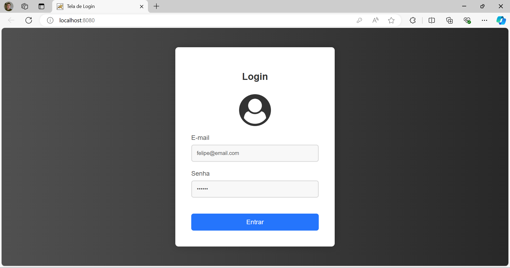
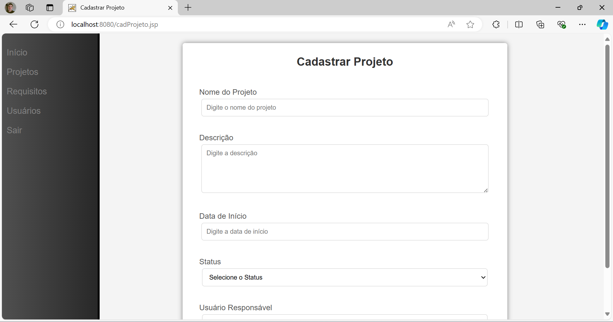
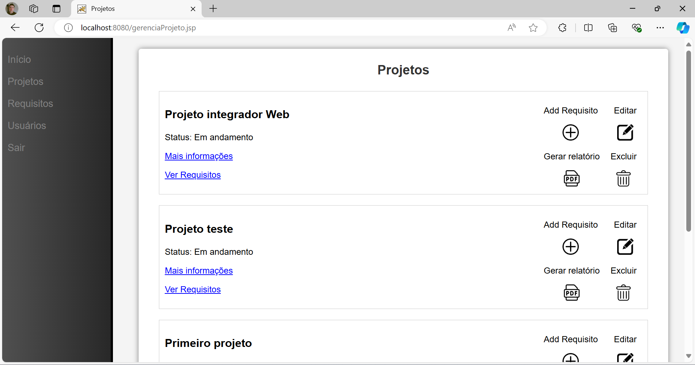

# Gestão de Projetos

## Descrição
Projeto desenvolvido como parte de um trabalho da faculdade de Análise e Desenvolvimento de Sistemas, para consolidar os conhecimentos relacionados ao desenvolvimento de 
aplicações para a plataforma web. O objetivo desse sistema é gerenciar os requisitos de software de uma equipe de desenvolvimento, possuindo funcionalidades para criar
projetos, definir os requisitos de software e mantê-los cadastrados por meio de atualizações (versionamento).

## Funcionalidades Principais
- **Cadastro de Usuários:** Permite adicionar novos usuários
- **Cadastro de Projetos:** Criar e gerenciar projetos.
- **Gestão de Requisitos:** Adicionar e gerenciar requisitos dos projetos, incluindo descrição, status, prioridade e complexidade.
- **Versionamento:** Permite acompanhar as diferentes versões dos requisitos.

## Tecnologias Utilizadas
- **Java:** Linguagem principal utilizada no backend.
- **JSP(JavaServer Pages):** Para construção da interface web e controle.
- **HTML/CSS:** Estrutura e estilo das páginas web.
- **JavaScript:** Utilizado para validações e interatividade no lado do cliente.
- **PostgreSQL**: Banco de dados relacional.
- **iText:** Biblioteca para geração de relatórios em PDF.

## Imagens do Projeto

### Tela de login

### Cadastro de Projetos

### Lista de Projetos

